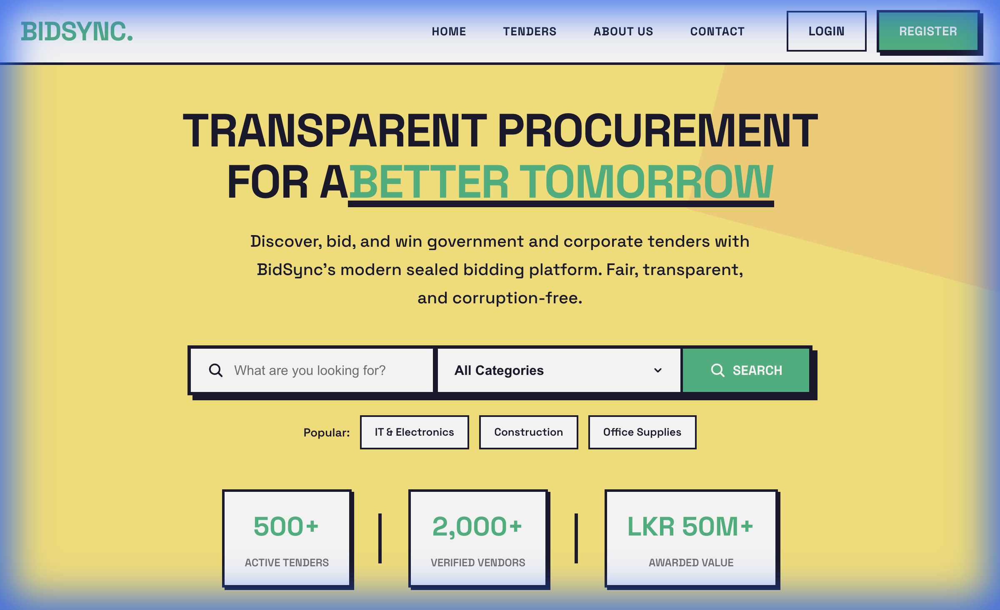
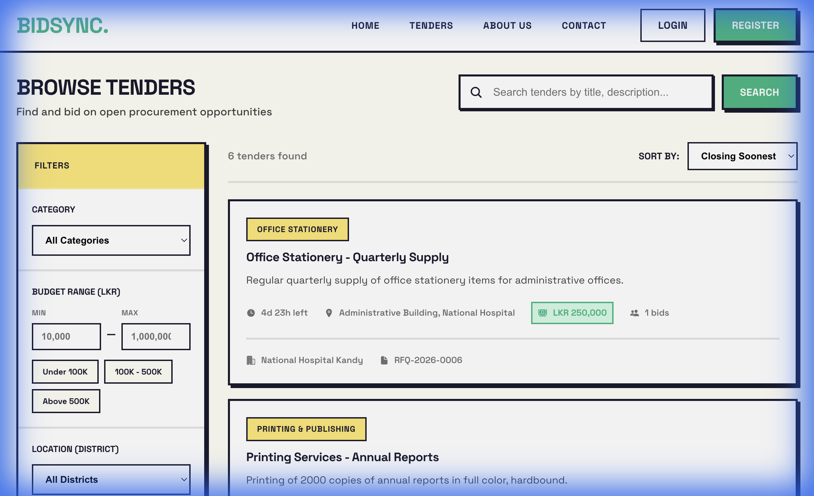
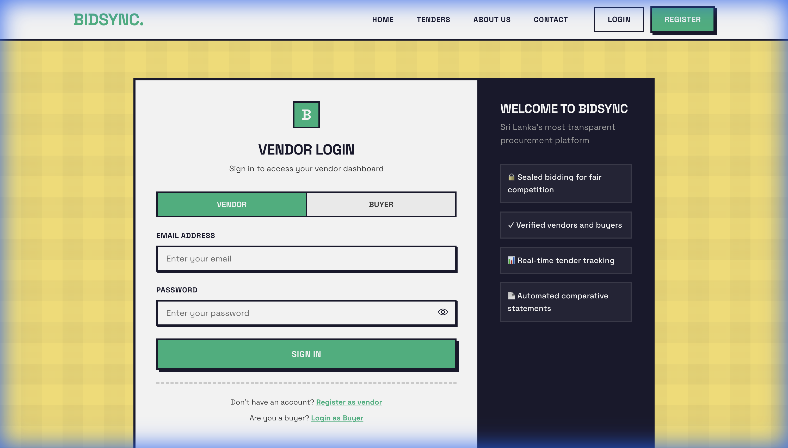

<p align="center">
  
</p>

<h1 align="center">🏢 BidSync</h1>

<p align="center">
  <strong>Micro-Procurement & Tender Management System</strong><br/>
  A modern, transparent platform for government and corporate tender management with sealed bidding.
</p>

<p align="center">
  <a href="https://bidsync.online"></a>
  <a href="https://github.com/monithishanka/BidSync"></a>
</p>

<p align="center">
  <a href="#features">Features</a> •
  <a href="#tech-stack">Tech Stack</a> •
  <a href="#screenshots">Screenshots</a> •
  <a href="#getting-started">Getting Started</a> •
  <a href="#roadmap">Roadmap</a>
</p>

---

## ✨ Features

### 🔐 Authentication & Authorization

- Multi-role system: **Admin**, **Buyer**, **Vendor**
- Session-based authentication with secure password hashing
- Strong password validation with real-time feedback

### 📋 RFQ Management (Buyers)

- Create, edit, and manage Request for Quotations
- Set budgets, deadlines, and delivery requirements
- Attach supporting documents (PDF, images)
- View and compare bids with automated ranking

### 💼 Bidding System (Vendors)

- Browse and filter open tenders by category, budget, and location
- Submit sealed bids (hidden until deadline)
- Track bid status and history
- Receive real-time notifications

### 📊 Admin Dashboard

- User management (approve/block accounts)
- Complete audit logging for transparency
- Platform statistics and analytics
- Bid oversight and moderation

### 🔔 Notifications

- Real-time notifications for bid updates
- Tender status changes
- Award announcements

### 📄 Additional Features

- PDF export for comparative statements
- Rating & feedback system
- Comprehensive audit trails
- Responsive Neo-Brutalist UI design

---

## 🛠️ Tech Stack

| Layer              | Technology                       |
| ------------------ | -------------------------------- |
| **Frontend**       | React 19, Vite 7, React Router 7 |
| **Styling**        | CSS3 (Neo-Brutalism design)      |
| **Backend**        | Node.js, Express 4               |
| **Database**       | MongoDB Atlas (Mongoose 8)       |
| **Authentication** | Express Session + bcryptjs       |
| **File Uploads**   | Multer                           |
| **PDF Generation** | PDFKit                           |
| **Icons**          | React Icons                      |

---

## 📸 Screenshots

<details>
<summary><strong>🏠 Home Page</strong></summary>
<br/>

</details>

<details>
<summary><strong>📋 Tenders Listing</strong></summary>
<br/>

</details>

<details>
<summary><strong>🔑 Login Page</strong></summary>
<br/>

</details>

---

## 🚀 Getting Started

### Prerequisites

- Node.js 18+
- MongoDB Atlas account (or local MongoDB)
- npm or yarn

### Installation

1. **Clone the repository**

   ```bash
   git clone https://github.com/monithishanka/BidSync.git
   cd BidSync
   ```

2. **Set up the server**

   ```bash
   cd server
   cp .env.example .env
   # Edit .env with your MongoDB URI and session secret
   npm install
   ```

3. **Set up the client**

   ```bash
   cd ../client
   npm install
   ```

4. **Run the development servers**

   Terminal 1 (Server):

   ```bash
   cd server
   npm run dev
   ```

   Terminal 2 (Client):

   ```bash
   cd client
   npm run dev
   ```

5. **Open your browser**
   - Frontend: http://localhost:5173
   - API: http://localhost:5001

---

## 🔮 Roadmap

### ✅ Phase 1: MVP (Current)

- Core RFQ and bidding functionality
- Multi-role authentication
- Admin dashboard
- Notifications system
- PDF exports

### 🔜 Phase 2: AI-Powered Price Prediction

- Machine learning model to suggest fair prices to buyers
- Historical bid data analysis
- Market rate benchmarking

### 🔗 Phase 3: Blockchain Integration

- Immutable audit trails using blockchain
- Tamper-proof bid submissions
- Transparent procurement verification

### 📱 Phase 4: Mobile App

- React Native mobile application
- On-the-go bidding for vendors
- Push notifications
- Offline mode support

---

## 📁 Project Structure

```
BidSync/
├── client/                 # React frontend (Vite)
│   ├── src/
│   │   ├── components/     # Reusable UI components
│   │   ├── context/        # React Context (Auth)
│   │   ├── pages/          # Page components
│   │   │   ├── admin/      # Admin dashboard
│   │   │   ├── buyer/      # Buyer pages
│   │   │   └── vendor/     # Vendor pages
│   │   └── services/       # API service layer
│   └── public/
├── server/                 # Express backend
│   ├── config/             # Database configuration
│   ├── middleware/         # Auth middleware
│   ├── models/             # Mongoose models
│   ├── routes/             # API routes
│   ├── scripts/            # Utility scripts
│   └── utils/              # Helper functions
└── screenshots/            # UI screenshots
```

---

## 👥 Credits

Developed by **Group 26**

---

## 📄 License

This project is for educational purposes.

---

<p align="center">
  Made with ❤️ for transparent procurement
</p>
